# Tags
Tags are way to classify clips by their content. Clips are not restricted to any one tag. You can link a clip to any tag you like. 

## Tagging Content
There are a few ways you can link a clip to tag:
1. Right-click (desktop) or hold (mobile) over a clip to reveal the clip context menu
2. Hover and/or select the 'Tags' menu item
3. Left-click or tap the Tag to link to the clip

:::tip
Clips (including sub-selections within one) or any supported external drag input can be automatically linked to a tag by dragging it onto the button or *query tray* if its the active tag. (Clips/sub-selection will be duplicated if dragged with the <kbd>Control</kbd> key)
:::

## Direct vs. Indirect Links

:::note 
In the clip context-menu Direct and Indirect tags are denoted by a ✔️ or • respectively 
:::

### Example
Tags are hierarchial. So say you add an image of a banana split to the bananas tag:

```mermaid
graph TB
    A["🧺Fruits"]
    B["🍌Bananas"]
    C["🥥Coconuts"]
    D["🍨 Clip"]
    A --> B
    A --> C
    B -- *linked* --> D
```

Now the clip is **directly** linked to the *Bananas* tag and selecting it will show it as a result in the *query tray*. It is also **indirectly** associated with the *Fruits* tag. Selecting the *Fruits* tag will also show the clip since *Bananas* is a child tag. If you move (by drag-and-drop) the *Bananas* tag somewhere outside of *Fruits* then the *Fruits* tag will no longer show the clip since it was only *indirectly* linked. But the link to *Bananas* will remain since it was **directly** linked. If however, you **directly** linked the clip to *Fruits* nothing will change when selecting the *Fruits* tag.
